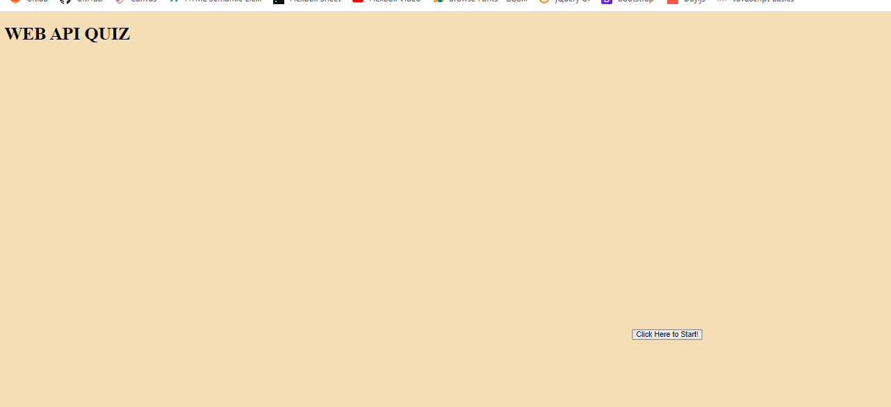

## Description 
GIVEN I am taking a code quiz
WHEN I click the start button
THEN a timer starts and I am presented with a question
WHEN I answer a question
THEN I am presented with another question
WHEN I answer a question incorrectly
THEN time is subtracted from the clock
WHEN all questions are answered or the timer reaches 0
THEN the game is over
WHEN the game is over
THEN I can save my initials and my score

## Project URL
  https://github.com/csherman177/CodingQuiz 

## Deployment
  https://csherman177.github.io/CodingQuiz/

## Demo/Screenshots
  <table>
  <tr>
    <td>Coding Quiz</td>
  </tr>
  <tr>
    <td></td>
  </tr>
  </table>
 
  ## Contact
  Email: csherman177@gmail.com

  ## Author
  Author(s): Courtney Sherman 
  GitHub: https://github.com/csherman177/ 